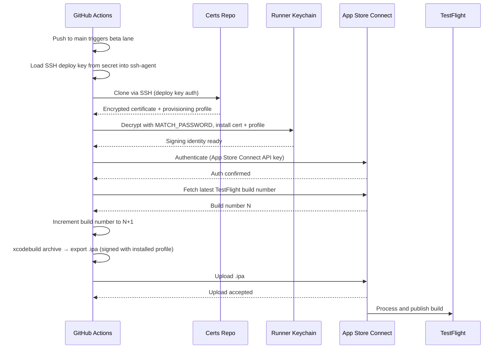

# CountThat: A simple app for counting things


Released as "It Counts For You" on the Apple App Store.

## App Store Compliance

### Encryption (US Export Compliance)

App Store Connect requires a declaration of what encryption algorithms the app uses, under US Export Administration Regulations (EAR). Every submission prompts for one of four options:

| Option | Meaning                                                                         |
| ------ | ------------------------------------------------------------------------------- |
| A      | Proprietary or non-standard encryption (not approved by IEEE, IETF, ITU, etc.)  |
| B      | Standard encryption algorithms, implemented directly or via third-party library |
| C      | Both A and B                                                                    |
| D      | None of the above                                                               |

**CountThat uses option D** — it transmits no data and implements no encryption of its own. All persistence is local.

> **Note on future CloudKit + SwiftData sync:** If automatic CloudKit integration is enabled via SwiftData, the encryption classification does **not change** — it remains option D / `ITSAppUsesNonExemptEncryption = NO`. See the [SwiftData + CloudKit section](#swiftdata--cloudkit-automatic-sync) below for details.

**How to determine the right option for other apps:**

- **Apps using only Apple frameworks** (URLSession, CloudKit, SwiftData, CoreData with CloudKit sync, Sign in with Apple) — Apple's frameworks use TLS and AES internally, but Apple holds the export licenses for those. An app that only calls Apple APIs and adds no encryption of its own qualifies as **exempt**. Select D, or set `ITSAppUsesNonExemptEncryption = NO` in Info.plist to skip the prompt entirely on future submissions.

- **Apps using standard encryption directly** (CryptoKit for custom protocols, third-party libraries like OpenSSL, libsodium, or any TLS stack outside of Apple's) — select B. May require filing an Annual Self Classification Report with the US Bureau of Industry and Security (BIS).

- **Apps using custom or proprietary encryption** — select A or C. Likely requires an Encryption Registration Number (ERN) from BIS before submission.

#### SwiftData + CloudKit Automatic Sync

SwiftData can be configured to sync automatically with CloudKit by using a `ModelConfiguration` with a CloudKit container identifier, or by using `NSPersistentCloudKitContainer` under the hood. When enabled, the framework transparently syncs model data across a user's devices via iCloud.

From an export compliance perspective, this is fully **exempt** — the same as not having sync at all:

- **Transport encryption:** CloudKit uses TLS 1.2+ for all data in transit. Apple holds the EAR export license for this, not the app developer. ([Apple Platform Security Guide — iCloud security overview](https://support.apple.com/guide/security/icloud-data-security-overview-secdaef4f1e7/web))
- **At-rest encryption:** CloudKit encrypts data at rest using AES-128 or AES-256, again under Apple's export license. Some CloudKit fields use end-to-end encryption (only decryptable on the user's trusted devices); others use standard encryption (accessible to Apple for service purposes). The developer does not implement or configure any of this directly.
- **Developer responsibility:** Zero. The app calls `ModelContainer(for:configurations:)` or similar SwiftData APIs — no cryptographic code is written or bundled by the app.

Because the app adds no encryption beyond what Apple's frameworks provide, it still qualifies as **exempt** under EAR. `ITSAppUsesNonExemptEncryption = NO` remains correct after enabling CloudKit sync.

**Official Apple documentation:**

- [Complying with Encryption Export Regulations](https://developer.apple.com/documentation/security/complying-with-encryption-export-regulations) — Apple's canonical guidance; confirms apps using only Apple-provided encryption are exempt
- [iCloud Data Security Overview](https://support.apple.com/guide/security/icloud-data-security-overview-secdaef4f1e7/web) — details what CloudKit encrypts, how, and who holds the keys
- [Adopting SwiftData for a Core Data app](https://developer.apple.com/documentation/coredata/adopting-swiftdata-for-a-core-data-app) — migration path from CoreData + NSPersistentCloudKitContainer to SwiftData

**Automating the declaration** — add to Info.plist to avoid the prompt on every submission:

```xml
<key>ITSAppUsesNonExemptEncryption</key>
<false/>
```

Use `<true/>` if the app uses non-exempt encryption — App Store Connect will then require an ERN or compliance documentation.

### App Icon (No Transparency)

App Store Connect rejects the app icon (`CountThat/Assets.xcassets/AppIcon.appiconset/logo.png`) if it has an alpha channel — the icon must be fully opaque. This has broken TestFlight uploads before; the `verify_app_icon` Fastlane action (see [fastlane/actions/verify_app_icon.rb](./fastlane/actions/verify_app_icon.rb)) now checks for this before every `beta`/`release` run.

The icon's source is `logo.svg`, edited in Inkscape. Inkscape's PNG exporter **always** writes an alpha channel — even with a fully opaque background and `--export-background-opacity=1.0` explicitly set — so no SVG-only setting makes a plain File > Export come out alpha-free. Use the wrapper script instead of exporting manually:

```bash
./scripts/export_icon.sh
```

This runs the Inkscape export at 1024x1024 and immediately strips the alpha channel, writing straight to `CountThat/Assets.xcassets/AppIcon.appiconset/logo.png`. Confirmed working end-to-end on this machine.

If you need to flatten an already-exported PNG by hand instead, any of the following work:

**`sips`** (built into macOS, no install needed — confirmed working on this machine where neither ImageMagick nor Pillow were installed). Round-tripping through JPEG strips the alpha channel, since JPEG has none:

```bash
sips -s format jpeg logo.png --out /tmp/logo.jpg
sips -s format png /tmp/logo.jpg --out logo.png
```

`sips` composites transparent pixels onto **black** during this conversion — fine if the icon's transparent regions are meant to be dark/edge antialiasing, but check the result visually. If you need a specific fill color (e.g. white), use one of the alternatives below instead.

**ImageMagick** (`brew install imagemagick`; also preinstalled on GitHub's macOS runners) — lets you pick the fill color explicitly:

```bash
convert logo.png -background white -alpha remove -alpha off logo.png
```

**`mini_magick` gem** (already a transitive Fastlane dependency — same operation from Ruby, useful if scripting the fix):

```ruby
require "mini_magick"
img = MiniMagick::Image.open("logo.png")
img.combine_options { |c| c.background("white"); c.alpha("remove"); c.alpha("off") }
img.write("logo.png")
```

Verify the result has no alpha channel, regardless of which method you used:

```bash
sips -g hasAlpha logo.png   # should print: hasAlpha: no
```

Apply the same fix to `CountThat/Assets.xcassets/AppIcon.appiconset/logo.png` and, if you want them to stay in sync, the top-level source `logo.png`/`logo.svg`.

## Testing via Fastlane

Fastlane can be used to run tests. Simulators for all listed devices must be installed first. For example, in the following lane definition, the `run_tests` action lists iPhone 16 as the sole test target.

```ruby
desc "Run unit and UI tests"
lane :test do
run_tests(
    scheme: "CountThat",
    devices: ["iPhone 16"],
    clean: true,
    result_bundle: true
)
end
```

Therefore, the iPhone 16 simulator would need to be installed in order to run these tests. Simulators can be installed from the Simulator application via File -> New Simulator in the menu bar.

If the necessary simulators and other required software is installed on the system, running the rollowing command should run the tests via Fastlane.

```bash
bundle exec fastlane test
```

See the [Fastlane README](./fastlane/README.md) for more detail.

## CI/CD Setup

GitHub Actions runs CI (lint + test) on PRs and CD (TestFlight on merge to `main`, App Store on `v*.*.*` tags) via Fastlane.

### TestFlight Release Flow



### Repository Security Settings

#### Certificates repo

| Setting       | Required value | Why                                                                                                                                                                                                                                     |
| ------------- | -------------- | --------------------------------------------------------------------------------------------------------------------------------------------------------------------------------------------------------------------------------------- |
| Visibility    | **Private**    | Encrypted certs are exposed if public — `MATCH_PASSWORD` becomes the only protection against offline brute-force                                                                                                                        |
| Forking       | **Disabled**   | No legitimate reason to fork a cert repo; forks widen exposure                                                                                                                                                                          |
| Actions       | **Disabled**   | Cert repo needs no workflows; disabling eliminates the Actions attack surface entirely                                                                                                                                                  |
| Collaborators | Minimal        | Only grant access to accounts that genuinely need it. The PAT used for `MATCH_GIT_BASIC_AUTHORIZATION` should belong to a dedicated machine account, not a personal account, so its permissions can be scoped and revoked independently |

#### App repo

| Setting                             | Required value                                               | Why                                                                                                                                                                              |
| ----------------------------------- | ------------------------------------------------------------ | -------------------------------------------------------------------------------------------------------------------------------------------------------------------------------- |
| Visibility                          | Public or private — your choice                              | Secrets are never exposed to fork PRs by default regardless of visibility                                                                                                        |
| Fork pull request workflows         | **Require approval for all outside collaborators** (default) | Prevents a malicious fork PR from triggering a workflow run in your repo's context. Do not set to "Run workflows from fork pull requests" without understanding the implications |
| Send secrets to fork workflows      | **Disabled** (default)                                       | If ever enabled, fork PRs gain access to all repository secrets — including signing credentials                                                                                  |
| Actions permissions                 | **Allow only GitHub-owned and verified creator actions**     | Prevents a supply-chain attack via a malicious third-party action introduced in a PR or dependency update                                                                        |
| Workflow permissions (GITHUB_TOKEN) | **Read-only** (default)                                      | Limits what a compromised or malicious workflow can do to the repo itself                                                                                                        |
| Branch protection on `main`         | **Enabled** — require PR + passing CI                        | Prevents direct pushes that bypass CI and accidental CD triggers from unreviewed code                                                                                            |

### App Store Connect API Key

Generate the key at App Store Connect → Users & Access → Integrations → Keys. You will need to request permission to use the App Store Connect API on first visit — approval is automatic.

Use the **App Manager** role — sufficient for uploading builds and submitting for review without granting unnecessary Admin access.

### App Review Information (First Submission Pitfall)

The **very first** version of a new app submitted via `upload_to_app_store` will fail with a cryptic `[!] No data (RuntimeError)` deep in spaceship's `fetch_app_store_review_detail`, even though the build, signing, and metadata upload all succeeded.

**Why:** `deliver` tries to fetch the app's existing App Review Information from App Store Connect to attach it to the submission. For a brand-new app, no App Review Information has ever been submitted, so the API returns nothing — and `deliver` doesn't handle that null response gracefully. See [fastlane/fastlane#20538](https://github.com/fastlane/fastlane/issues/20538).

**Fix:** supply `app_review_information` explicitly in the `upload_to_app_store` call (see `fastlane/Fastfile`) rather than relying on it already existing in App Store Connect. This repo pulls it from the `APP_REVIEW_FIRST_NAME`, `APP_REVIEW_LAST_NAME`, `APP_REVIEW_PHONE`, and `APP_REVIEW_EMAIL` repo secrets. Once a first version has been submitted successfully, App Store Connect retains this info and the crash won't recur even without these fields — but passing them explicitly keeps every submission reproducible from a clean slate (e.g. after deleting and recreating the app).

#### Log exposure threat model

`APP_REVIEW_FIRST_NAME`/`APP_REVIEW_LAST_NAME`/`APP_REVIEW_PHONE`/`APP_REVIEW_EMAIL` are personal contact info, not secrets in the "compromises the app" sense — but they shouldn't sit in plaintext in CI logs either. Verified against the installed `fastlane-2.237.0` gem source (`deliver/lib/deliver/runner.rb:29`):

```ruby
FastlaneCore::PrintTable.print_values(config: options, hide_keys: [:app], mask_keys: ['app_review_information.demo_password'], title: "deliver #{Fastlane::VERSION} Summary")
```

`deliver`'s own summary table only masks `demo_password`. `first_name`, `last_name`, `phone_number`, `email_address` are nested inside the `app_review_information` hash passed to `upload_to_app_store`, and `PrintTable.collect_rows` (`fastlane_core/lib/fastlane_core/print_table.rb`) recurses into any value that responds to `:key` — which a `Hash` does — printing each nested field as its own row, unmasked, into the job log. fastlane provides zero protection here on its own.

**Why it's still safe:** GitHub Actions masks every exact-match occurrence of a value registered as a secret, anywhere in the job log — not just at the point it's assigned to `env:`. This is the same mechanism already visible in this repo's logs today: `APPLE_ID`/`TEAM_ID`/`MATCH_GIT_URL` get redacted to `***` in both the `match` and `deliver` summary tables, i.e. redacted at _every_ print site, not just the first. `fastlane/Fastfile` passes the four review-info values via `ENV["APP_REVIEW_*"]`, and `.github/workflows/cd.yml` sets those from `${{ secrets.APP_REVIEW_* }}` — same pattern as the values already proven to redact correctly.

Two conditions have to hold for that blanket redaction to actually apply, both true here:

1. **Must be registered as a repo Secret, not a Variable.** GitHub Variables (`vars` context) are never masked — only `secrets` context values are. If these were ever added under Settings → Secrets and variables → Actions → _Variables_ instead of _Secrets_, they'd print in plaintext with no protection at all.
2. **Value must survive to the log unmodified.** GitHub's masking is an exact-substring match. `PrintTable`'s table renderer normally wordwraps long values, which could split a secret across lines and defeat the match — but `should_transform?` in `print_table.rb` disables that wordwrap whenever `FastlaneCore::Helper.ci?` is true, which it is on GitHub Actions (`CI=true` is set by the runner). So under the lanes as currently written, values print as a single unbroken line.

**Remaining risks (accepted):**

| Risk                                                                               | Likelihood | Impact | Mitigation                                                                                                                                                                           |
| ---------------------------------------------------------------------------------- | ---------- | ------ | ------------------------------------------------------------------------------------------------------------------------------------------------------------------------------------ |
| Secrets added as repo Variables instead of Secrets                                 | Low        | Medium | Documented here; double-check the Secrets tab was used when setting these up                                                                                                         |
| A future lane adds `--verbose` or another flag that reformats/encodes these values | Low        | Medium | Masking relies on an exact-string match; any transform (base64, case change, JSON-escaping) before printing would defeat it — avoid adding debug/verbose flags to the `release` lane |
| Values exposed via App Store Connect UI itself (not a CI log risk)                 | N/A        | N/A    | Expected — reviewers and the app owner are meant to see this contact info there                                                                                                      |

### Precheck vs. In-App Purchases (API Key Pitfall)

`upload_to_app_store` runs `precheck` before submitting by default (`run_precheck_before_submit: true`), which scans metadata for App Review guideline violations. If the app has no in-app purchases, this still fails:

```
[!] Precheck cannot check In-app purchases with the App Store Connect API Key (yet).
Exclude In-app purchases from precheck, disable the precheck step in your build step, or use Apple ID login
```

**Why:** `precheck`'s in-app purchase check requires an authentication method that has access to a different, older API surface than the App Store Connect API key supports — see fastlane's own message above. This repo's lanes authenticate exclusively via `app_store_connect_api_key` (see `setup_asc_api_key` in `fastlane/Fastfile`) to avoid password/2FA prompts in CI, so this check can never succeed here regardless of whether the app actually has in-app purchases.

**Fix:** CountThat has no in-app purchases, so `precheck_include_in_app_purchases: false` is set on the `upload_to_app_store` call — this excludes only that one check and leaves the rest of precheck (screenshots, description, keywords, etc.) running. If a future app in this family _does_ sell in-app purchases, that check would need to run via Apple ID login instead (`run_precheck_before_submit: false` combined with a manual precheck pass, or dropping the API key for that lane) — the hard error itself is unconditional in this fastlane version, thrown from `precheck/lib/precheck/runner.rb:37` (and mirrored in `deliver/lib/deliver/runner.rb:96`) whenever API-key auth is used and the check isn't excluded.

### App Metadata Required for First Submission (Age Rating, Category, Pricing, Privacy)

A brand-new app has none of the App Store Connect metadata that only lives at the *app* level (as opposed to the version-scoped fields `deliver` already manages, like description and screenshots). `submit_for_review` rejects the review submission with a wall of "missing required attribute" errors the first time, e.g.:

```
The provided entity is missing a required relationship - You must provide a value for the relationship 'primaryCategory' with this request
The provided entity is missing a required attribute - You must provide a value for the attribute 'violenceCartoonOrFantasy' with this request
[... ~20 more age-rating attributes ...]
Answers to what data your app collects and how it's used are needed. - You must have published answers to your app's data usages.
App is missing required pricing. - App is not eligible for submission until pricing has been set.
```

**Why:** these are one-time, app-level fields Apple expects to be set once and left alone — App Store Connect's web UI walks a human through them when creating a new app, but `upload_to_app_store` skips that flow entirely.

**Fix:** the `release` lane now sets all of these explicitly so a from-scratch app is submittable in CI:

- `primary_category: "UTILITIES"` and `app_rating_config_path: "fastlane/metadata/app_rating_config.json"` on `upload_to_app_store` — the JSON answers every age-rating question with "none of this content" (CountThat has no violence, gambling, mature themes, user-generated content, etc.), matching `Spaceship::ConnectAPI::AgeRatingDeclaration`'s attribute names directly (verified against `spaceship/lib/spaceship/connect_api/models/age_rating_declaration.rb` in the installed `fastlane-2.237.0` gem — unrecognized-to-legacy-ITC key mapping is a no-op for keys already in the new form). Use the raw enum value (`UTILITIES`), not the legacy display name (`Utilities`) — the latter still works via a compatibility mapping but prints a deprecation warning on every run.
- `submission_information: { content_rights_contains_third_party_content: false }` — CountThat has no third-party content.
- **App Privacy ("data usages") and Pricing can't be automated here — set both manually, once.** Two attempts were made and both hit fastlane API paths that no longer match the live App Store Connect schema:
  - A `declare_no_data_collection` lane published the "Data Not Collected" declaration via `Spaceship::ConnectAPI::AppDataUsagesPublishState`. Its endpoint (`GET /v1/apps/{id}/dataUsagePublishState`, in `spaceship/lib/spaceship/connect_api/tunes/tunes.rb:304`) was rejected: `The URL path is not valid - The relationship 'dataUsagePublishState' does not exist`.
  - `price_tier: 0` (via `deliver/lib/deliver/upload_price_tier.rb`) tried to set a free price by patching the app with an `availableInNewTerritories` attribute and `prices`/`availableTerritories` relationships. Also rejected: `The provided entity includes an unknown attribute - 'availableInNewTerritories' is not an attribute on the resource 'apps'` (plus the same for both relationships).

  Both are the legacy App Store Connect API shape; Apple has since moved pricing to a different territory/price-point model and renamed the privacy relationship, and this version of `fastlane` (2.237.0) predates that change on both fronts. No combination of arguments on our end routes around a stale path baked into the gem, so both were removed rather than left in the critical path where they can never succeed. **One-time manual steps in App Store Connect, before first submission:**
  - App Privacy → "No, we do not collect data from this app" → publish (true per `docs/privacy.html`).
  - Pricing and Availability → select a price (Free).

  Neither needs repeating on future releases once set.

None of this is versioned per-release the way screenshots or release notes are — once App Store Connect has these values, subsequent releases won't hit these errors even without re-sending them, but sending them every time keeps the lane reproducible from a freshly created app (same rationale as the App Review Information pitfall above).

### Duplicate Screenshots (Upload Retry Race)

Screenshots showed up doubled in App Store Connect (each of the 6 images present twice per set) despite `overwrite_screenshots: true` deleting all existing sets before every upload.

**Why:** confirmed from the CI log (run `29698286862`) — `deliver` uploaded all 6 screenshots, then polled and found them fully processed, then ran a post-upload checksum verification (`deliver/lib/deliver/upload_screenshots.rb#verify_local_screenshots_are_uploaded`) that incorrectly reported all 6 as `"is missing on App Store Connect"` — almost certainly an eventual-consistency lag between Apple marking an asset's `asset_delivery_state` as complete and that asset's checksum becoming visible for the very next API read. `retry_upload_screenshots_if_needed` treats this as a real failure and re-runs `upload_screenshots` from scratch. The in-upload dedup check (`app_screenshot_set.app_screenshots.any? { checksum match }`) is supposed to prevent exactly this, but it reads from `app_screenshot_set` objects captured before the retry, so it doesn't see the screenshots the first pass just uploaded — the retry re-uploads all 6 a second time instead of skipping them as duplicates.

**Fix:** this is a race inside `deliver` itself, not something exposed as a lane option — there's no workaround flag to reach for here. Practically, it self-heals: `overwrite_screenshots: true` deletes the *entire* screenshot set (dupes included) at the start of the *next* successful release run, before re-uploading fresh, so as long as a future run completes the screenshot-upload stage cleanly, the duplicates disappear on their own. No manual App Store Connect cleanup is required unless you want the current in-progress (unreleased) version to look correct before that next run.

### Running Match Locally

When running `match appstore` for the first time, Fastlane may prompt for your Apple developer account password.

**Why:** Match uses your Apple ID to authenticate with the Apple Developer Portal API to create and download certificates and provisioning profiles. This is separate from the App Store Connect API key, which only covers build uploads and submissions.

**How to avoid entering your password — use the API key instead:**

Fastlane can authenticate with the Developer Portal using the App Store Connect API key, bypassing the password prompt entirely. Create a wrapper lane and set the API key env vars before running it:

```bash
export APP_STORE_CONNECT_API_KEY_ID="..."
export APP_STORE_CONNECT_API_KEY_ISSUER_ID="..."
export APP_STORE_CONNECT_API_KEY_CONTENT="$(cat /path/to/AuthKey_XXXX.p8)"
bundle exec fastlane match_init
```

Add this lane to the Fastfile for local use:

```ruby
lane :match_init do
  setup_asc_api_key
  match(type: "appstore", readonly: false)
end
```

**If you must enter your password:**

- Input is hidden (no echo, not stored in shell history)
- Risks: shoulder surfing, process memory, screen recording
- Minimize by using a **dedicated Apple ID** with App Manager role scoped only to this app — not your primary developer account. If that credential is compromised, blast radius is limited to this app rather than your entire developer account

**macOS login keychain password:**

After authenticating with Apple, Match prompts for your macOS login password (the password used to unlock your Mac). Match needs this to install the decrypted certificate into your local keychain so Xcode can use it for signing. This is a local macOS operation — the password is never sent anywhere. To avoid the prompt on future runs, set the `MATCH_KEYCHAIN_PASSWORD` environment variable to your login password.

Fastlane Match stores encrypted certificates and provisioning profiles in a separate private git repository. This is the recommended approach for the following reasons:

**Why a separate repo, not the app repo:**
Keeping certs in the same repo as source code means a compromised repo leaks both. Separation limits blast radius — a breach of the app repo does not expose signing credentials.

**Why git, compared to alternatives:**

- **Local keychain only** — certs live on one machine. CI can't access them, and a new Mac requires manual re-export and re-trust. Doesn't scale past one developer.
- **Exporting `.p12` + provisioning profile as GitHub secrets** — works, but manual. Certs expire yearly; you must re-export, re-encode, and re-paste secrets each time. No audit trail. Error-prone.
- **Xcode automatic signing** — convenient locally but unreliable in CI. Requires an authenticated Xcode session and can silently generate new certs, hitting Apple's certificate limits.
- **Cloud storage (S3, GCS)** — Match supports these backends. Valid alternative, but requires a cloud account, IAM credentials, and billing setup. More moving parts than a private git repo for no meaningful benefit at this scale.
- **Private git repo (Match default)** — Match encrypts all files with `MATCH_PASSWORD` before pushing, so the repo is safe even if access is leaked. Version controlled, giving a full audit trail of cert changes. Shareable across team members by granting repo access. Free. Cert rotation is a single `fastlane match nuke` + re-run — no manual secret updates needed.

All credentials must be stored as **repository secrets** (Settings → Secrets and variables → Actions → Repository secrets). Do not use repository variables — those are plaintext and unsuitable for credentials. Environment secrets add deployment protection rules but are unnecessary overhead for a solo project.

**When the other options make sense:**

- **Environment secrets** — useful when deploying to multiple distinct targets (e.g. `staging` and `production` environments, each with different API keys). Also useful when you want a required-reviewer gate before a deployment runs — e.g. App Store submissions requiring a second person to approve. Each environment gets its own secret set and optional protection rules.
- **Repository variables** — plaintext, so only appropriate for non-sensitive config that varies by repo but is safe to expose in logs. Example: a feature flag name, a Slack channel ID, or a default simulator device name shared across workflows.
- **Environment variables** — same as repository variables but scoped per environment. Useful for values like a staging vs production App Store bundle ID, where the value differs between environments but isn't sensitive.

| Secret                                | Description                                                                                                                                                                                                                                                                                                                   |
| ------------------------------------- | ----------------------------------------------------------------------------------------------------------------------------------------------------------------------------------------------------------------------------------------------------------------------------------------------------------------------------- |
| `APPLE_ID`                            | Apple developer account email                                                                                                                                                                                                                                                                                                 |
| `TEAM_ID`                             | Apple developer team ID (10-char, found in Developer Portal → Membership)                                                                                                                                                                                                                                                     |
| `ITC_TEAM_ID`                         | App Store Connect team ID — often the same as `TEAM_ID` for individual accounts. Differs when the App Store Connect account belongs to a separate organization from the developer portal team, e.g. an agency managing multiple clients, or a company where the legal entity for publishing differs from the development team |
| `MATCH_GIT_URL`                       | SSH URL of private certificates repo: `git@github.com:you/countthat-certs.git`                                                                                                                                                                                                                                                |
| `MATCH_PASSWORD`                      | Match encryption passphrase — generate with `openssl rand -base64 32`. Store in a password manager; if lost, certs must be nuked and regenerated with `fastlane match nuke`                                                                                                                                                   |
| `MATCH_DEPLOY_KEY`                    | Ed25519 private key for the certs repo deploy key — see deploy key setup below                                                                                                                                                                                                                                                |
| `APP_STORE_CONNECT_API_KEY_ID`        | Key ID from App Store Connect                                                                                                                                                                                                                                                                                                 |
| `APP_STORE_CONNECT_API_KEY_ISSUER_ID` | Issuer ID from App Store Connect → Users & Access → Integrations → Keys — shown at the top of the keys list                                                                                                                                                                                                                   |
| `APP_STORE_CONNECT_API_KEY_CONTENT`   | Raw `.p8` key file contents                                                                                                                                                                                                                                                                                                   |

#### Setting up the Deploy Key for Match

Match clones the private certs repo using SSH. This is more secure than Basic Auth with a PAT: Basic Auth sends an encoded credential in the HTTP header (trivially decodable from base64 if leaked, and valid until manually revoked). SSH uses a keypair challenge-response — the private key never leaves the runner, nothing sensitive is transmitted.

**1. Generate a keypair**

```bash
ssh-keygen -t ed25519 -C "match-deploy-key" -f match_deploy_key -N ""
```

This creates `match_deploy_key` (private) and `match_deploy_key.pub` (public). Run this locally; do not commit either file.

**2. Add the public key as a read-only deploy key on the certs repo**

Certs repo → Settings → Deploy keys → Add deploy key → paste `match_deploy_key.pub` → leave "Allow write access" unchecked.

**3. Add the private key as a GitHub secret**

Paste the contents of `match_deploy_key` as the `MATCH_DEPLOY_KEY` repository secret in the app repo.

**4. Delete the local keypair**

```bash
rm match_deploy_key match_deploy_key.pub
```

The private key now exists only in the GitHub secret. The public key is on the certs repo. Neither is needed locally again unless rotating.

**5. Update `MATCH_GIT_URL` to use the SSH URL**

Set `MATCH_GIT_URL` to `git@github.com:you/countthat-certs.git` (not the HTTPS URL).

#### SSH agent setup

The workflow loads the SSH key manually, avoiding any third-party action dependency. The step uses `env:` to pass the secret and `printf '%s'` to write it — this combination avoids the key appearing in logs even when Actions step debug logging is enabled. See the threat model below for full detail.

```yaml
- name: Load SSH deploy key
  env:
    MATCH_DEPLOY_KEY: ${{ secrets.MATCH_DEPLOY_KEY }}
  run: |
    mkdir -p ~/.ssh
    printf '%s\n' "$MATCH_DEPLOY_KEY" > ~/.ssh/match_deploy_key
    chmod 600 ~/.ssh/match_deploy_key
    ssh-add ~/.ssh/match_deploy_key
    ssh-keyscan github.com >> ~/.ssh/known_hosts
```

**Considered: webfactory/ssh-agent**

`webfactory/ssh-agent` is a popular action that handles this setup. It was not used because third-party actions run inside the job with full access to all secrets — a supply chain risk. If the action's repository were compromised, a workflow pinned to a mutable tag like `@v0.9.0` would silently execute attacker code with access to `MATCH_DEPLOY_KEY` and all other job secrets on the next run. SHA-pinning (`@dc588b651f...`) mitigates tag mutation but not a compromise of the pinned commit itself. The manual approach above eliminates the dependency entirely at the cost of owning the ssh-agent setup details.

#### Manual SSH key loading — log exposure threat model

The manual approach introduces its own risk depending on how the secret is referenced in the `run:` script.

**Unsafe pattern — inline expansion:**

```yaml
- name: Load SSH deploy key
  run: |
    echo "${{ secrets.MATCH_DEPLOY_KEY }}" > ~/.ssh/match_deploy_key
```

`${{ secrets.X }}` is a template expression evaluated before the shell script runs. The secret value is substituted directly into the script text. If Actions step debug logging is enabled (`ACTIONS_STEP_DEBUG=true` secret or variable), GitHub logs the rendered script body — including the expanded private key — before execution. GitHub masks known secret values in logs, but masking is applied line-by-line; a multi-line PEM key may not be fully masked if any individual line is too short or matches common strings.

**Safe pattern — env var:**

```yaml
- name: Load SSH deploy key
  env:
    MATCH_DEPLOY_KEY: ${{ secrets.MATCH_DEPLOY_KEY }}
  run: |
    printf '%s\n' "$MATCH_DEPLOY_KEY" > ~/.ssh/match_deploy_key
```

The template expression is in `env:`, not in `run:`. The script text only contains the variable name `$MATCH_DEPLOY_KEY` — the private key value never appears in the script body regardless of debug logging. `printf '%s'` is used instead of `echo` to avoid any trailing newline or interpretation of escape sequences in the key content.

The workflow uses the safe pattern. Do not refactor the step to inline the secret.

**Remaining risks (accepted):**

| Risk                                                         | Likelihood                           | Impact | Mitigation                                                              |
| ------------------------------------------------------------ | ------------------------------------ | ------ | ----------------------------------------------------------------------- |
| Key file readable by other steps in same job                 | Low — no other steps read `~/.ssh/`  | High   | Runner is ephemeral; file deleted when job ends                         |
| Key loaded into ssh-agent memory, accessible to subprocesses | Inherent to ssh-agent                | Medium | Scoped to the job; no untrusted subprocesses run after this step        |
| `ssh-keyscan` fetches wrong host key (MITM)                  | Very low — GitHub IPs are well-known | High   | Consider pinning known GitHub host keys instead of scanning dynamically |
